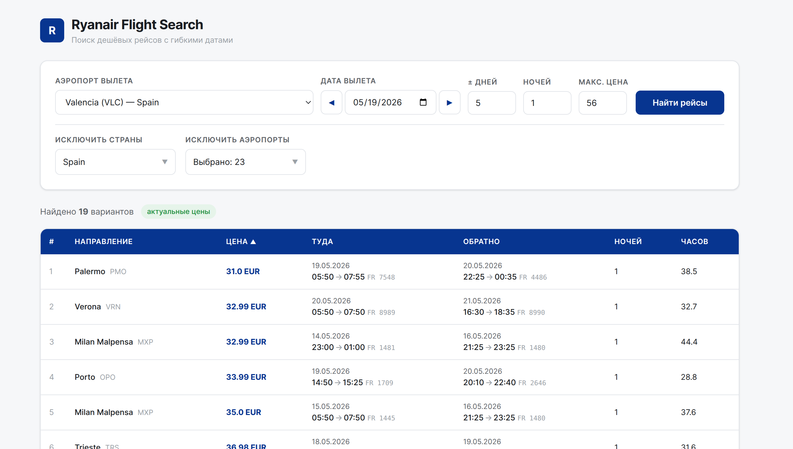

# Ryanair Flight Search

Search for cheap Ryanair round-trip flights with flexible dates, country/airport filters, and caching.



## Features

- Round-trip search from any Ryanair airport
- Flexible dates (±N days from selected date)
- Filters: max price, exclude countries/airports
- Web UI (Flask + HTMX) and CLI
- Stale-While-Revalidate caching strategy
- Dark mode, responsive layout (cards on mobile)
- Geolocation — auto-select nearest airport

## Installation

```bash
pip install -r requirements.txt
```

## Web UI

```bash
python3 app.py
```

Open http://localhost:5000

## CLI

```bash
# Search flights on a specific date
python3 main.py -d 2026-05-15 -n 1,2,3

# Weekend trip
python3 main.py -d 2026-03-20 -n 2

# One-day trips
python3 main.py --one-day

# Exclude airports
python3 main.py -d 2026-05-15 -n 1,2 -e AGP,MAD
```

## Tests

```bash
# Unit tests
pytest

# Playwright E2E tests
pytest tests/test_playwright.py -v
```

## Configuration

`config.yaml`:
- `origin_airport` — departure airport (default: VLC)
- `max_price` — max ticket price (EUR)
- `excluded_countries` — countries to exclude
- `date_flexibility_days` — ±days from departure date
- `max_arrival_time_destination` — latest arrival time

## License

[MIT](LICENSE)
